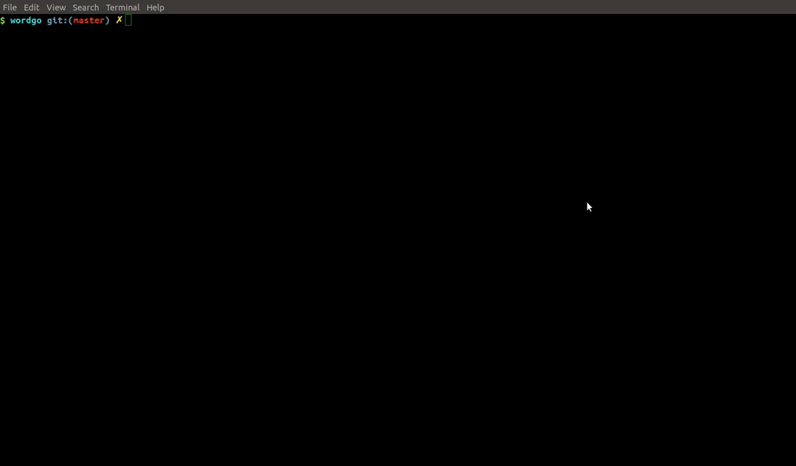

# wordgo  




Wordgo is a cross platform desktop application (English to Bengali dictionary) written using Go QML binding. The app uses [gotri](https://github.com/monirz/gotri) for loading the words in the Trie/Prefix tree  and [therecipe/qt](https://github.com/therecipe/qt) a QT Go binding library for making the UI. 

It has 135000 English word with multiple Bangla word menaing. The word-list is generated based on Ankur.org's Bangla-English [dictionary database](http://www.bengalinux.org/english-to-bengali-dictionary/about.htm. (Feel free to add any correction or add a new word).   

### Usage 
To use it just download the `wordgo` binary from the deploy directory for your specific platform and run it.  

## Build 
To install the dependency follow the [therecipe/qt](https://github.com/therecipe/qt) instruction for compiling QT application.  

```
$ make build 
```

The compiled binary file will be in the deploy/your-platform directory    
** compiling for Windows on Linux  ** 

```
$ make linux-to-windows 
```

# Contributing

1. Fork it
2. Create your feature branch (`git checkout -b my-new-feature`)
3. Make changes and add them (`git add .`)
4. Commit your changes (`git commit -m 'Added some feature'`)
5. Push to the branch (`git push origin my-new-feature`)
6. Create new pull request 


 